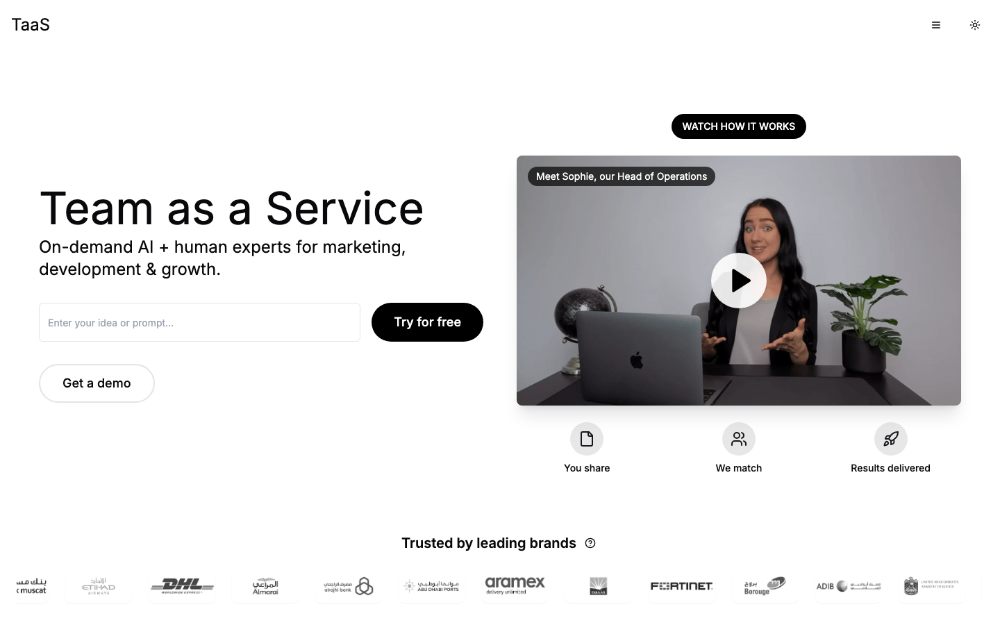
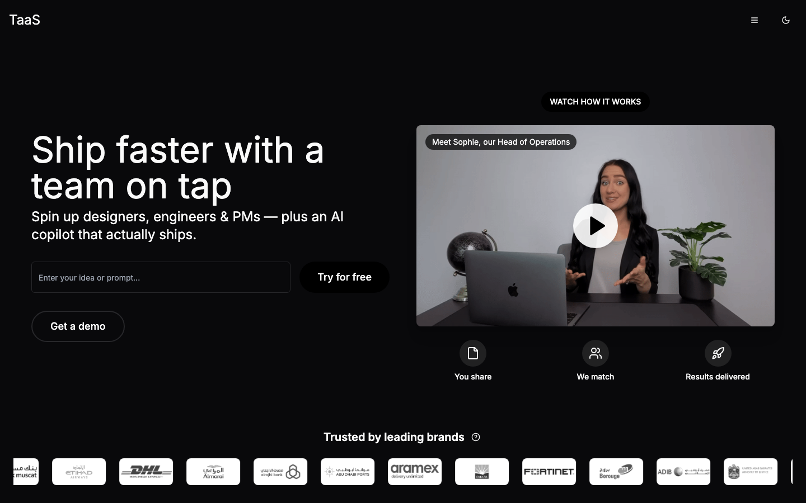
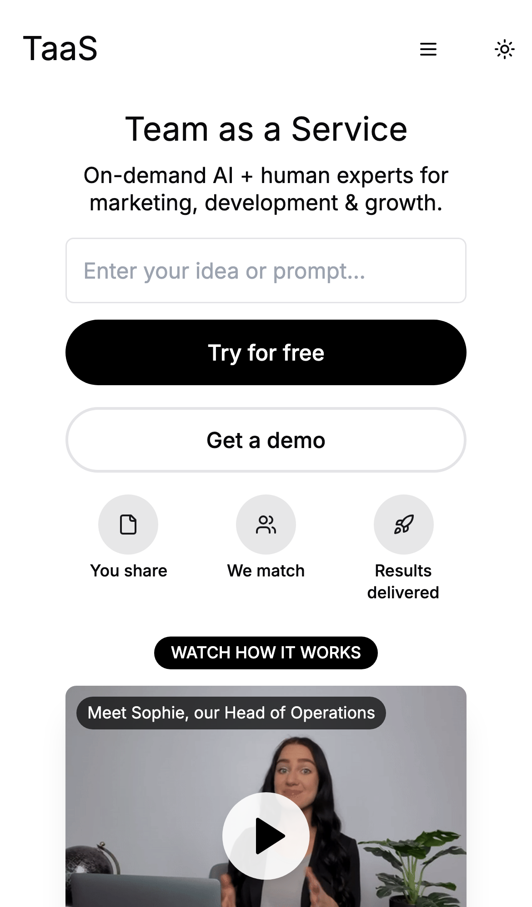

# TaaS — Team as a Service 🧑‍🚀

> Spin up a full product team on demand — designers, engineers, PMs, and an
> AI copilot that actually ships. **Build with teams, not headcount.**

TaaS is the marketing site and product surface for a "team-as-a-service"
platform. A visitor drops in an idea, and the site walks them through the whole
journey: from a punchy landing page, through a career/personality funnel, all
the way to workspace, calendar, task, and dashboard mockups that show what
working *with* your on-demand team feels like.

It's built as a fast single-page app with React, Vite, Tailwind, and shadcn/ui,
with a Supabase backend handling waitlist signups and confirmation emails.

<p align="center">
  
  
</p>

---

## ✨ What's inside

- **A landing page that sells** — hero, "How does an AI TaaS team work?" flow,
  a gallery of things the team has built, testimonials, industries served, and
  a clean pricing table. Light *and* dark, courtesy of a system-aware theme.
- **19 real routes** — pricing, about, a full careers board with job detail
  pages, a personality/careers test funnel, an AI-marketing page, a fashion
  case study, plus workspace, calendar, task, and employee dashboard mockups.
- **A career funnel with personality questions** — apply, answer, and land on a
  success page. Great for showing off the "we match people to teams" story.
- **Waitlist + beta signup** — wired to Supabase Edge Functions that send
  confirmation and waitlist emails.
- **Mobile-first, keyboard-friendly UI** — every page collapses gracefully to a
  slide-out nav on small screens.

<p align="center">
  
  
  
</p>

---

## 🛠 Tech stack

| Layer      | Tooling                                             |
| ---------- | --------------------------------------------------- |
| Framework  | React 18 + TypeScript                               |
| Build tool | Vite 5 (SWC)                                         |
| Styling    | Tailwind CSS + shadcn/ui (Radix primitives)         |
| Motion     | Framer Motion                                       |
| Data/state | TanStack Query, React Hook Form + Zod               |
| Charts     | Recharts                                            |
| Backend    | Supabase (Postgres, Storage, Edge Functions)        |
| Routing    | React Router v6 with lazy-loaded route chunks       |

---

## 🚀 Getting started

You'll need **Node.js 18+** and **npm** (the easiest way to get both is
[nvm](https://github.com/nvm-sh/nvm#installing-and-updating)). That's the only
hard requirement to run the front end locally.

```sh
# 1. Clone the repo
git clone https://github.com/waleedsworld/build-with-teams.git
cd build-with-teams

# 2. Install dependencies
npm install

# 3. Start the dev server (hot-reloading, instant preview)
npm run dev
```

Then open the URL Vite prints (defaults to **http://localhost:8080**). Edit any
file under `src/` and the page updates live.

### Build for production

```sh
npm run build     # outputs an optimized bundle to dist/
npm run preview   # serve the production build locally to sanity-check it
```

---

## 🔌 Supabase (optional, for signups & emails)

The app ships with a public (anon) Supabase key baked into
`src/integrations/supabase/client.ts`, so the marketing site runs out of the box.
If you want to point it at **your own** project:

1. Create a project at [supabase.com](https://supabase.com).
2. Swap `SUPABASE_URL` and `SUPABASE_PUBLISHABLE_KEY` in
   `src/integrations/supabase/client.ts` for your project's values.
3. Apply the SQL in `supabase/migrations/` to set up the templates bucket and
   tables.
4. Deploy the Edge Functions in `supabase/functions/` (waitlist + confirmation
   email) with the Supabase CLI.

> The bundled key is a **public anon key** — safe to expose by design. Never
> commit a service-role key.

---

## 📁 Project layout

```
build-with-teams/
├── public/            # static assets, email templates, uploads
├── src/
│   ├── components/     # navigation, sections, dialogs + shadcn/ui kit
│   ├── pages/          # 19 route components (lazy-loaded)
│   ├── data/           # job listings, seed content
│   ├── hooks/          # use-mobile, use-toast, …
│   ├── integrations/   # supabase client + generated types
│   ├── App.tsx         # router + providers
│   └── main.tsx        # entry point
├── supabase/           # migrations + edge functions
└── vite.config.ts
```

---

## 🧭 Notable routes

| Path                  | What it shows                          |
| --------------------- | -------------------------------------- |
| `/`                   | The main landing page                  |
| `/pricing`            | Starter / Pro / Enterprise plans       |
| `/about`              | Company story                          |
| `/careers`            | Job board (`/careers/:jobId` for each) |
| `/career/apply`       | Application + personality funnel       |
| `/dashboard`          | Employee task dashboard mockup         |
| `/workspace`          | Workspace view                         |
| `/calendar`           | Team calendar                          |
| `/ai-marketing`       | AI-marketing landing                   |
| `/fashion-case-study` | Case study page                        |

---

## 🌐 Live demo

**Live demo — deploying soon.** (Build it yourself in under a minute with the
steps above in the meantime.)

---

## 📝 Notes on this build

A couple of engineering niceties baked into this cut:

- **Route-level code splitting.** Every page is lazy-loaded, so the initial
  bundle only carries the landing page. The main chunk dropped from ~986 kB to
  ~396 kB, and heavy vendors (React, Recharts) live in their own long-cache
  chunks.
- **A preloader that can't get stuck.** The landing page waits on CDN images,
  but now falls back to rendering after a short grace period — no more infinite
  spinner if one image hangs.

Built with care by **Waleed Ajmal**.
