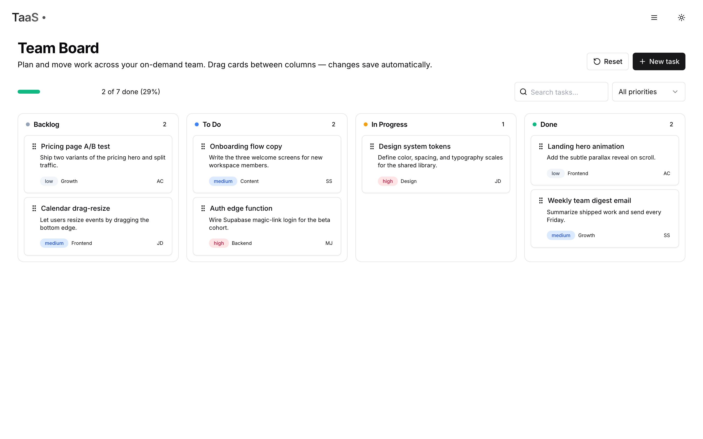
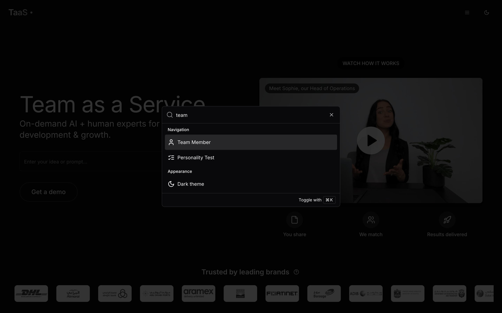
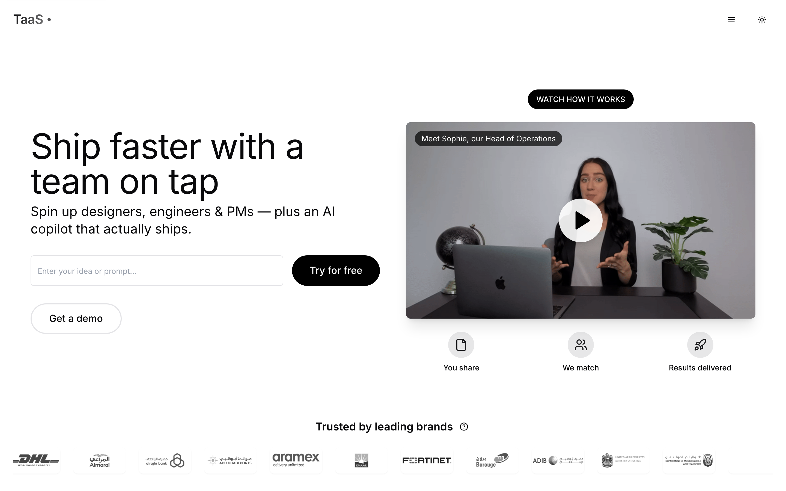
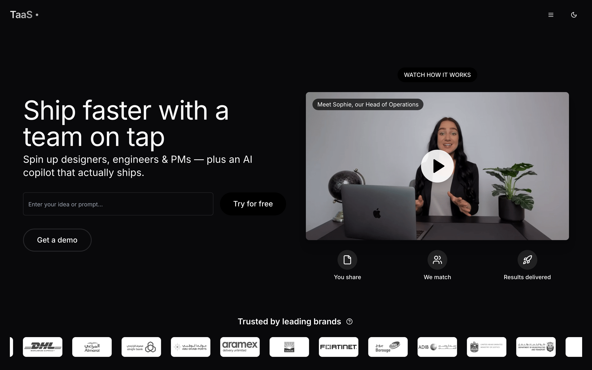
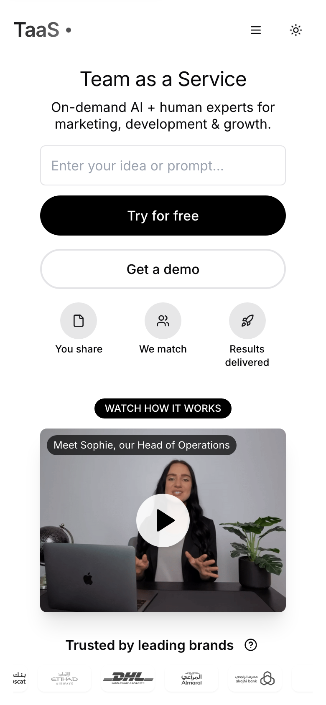
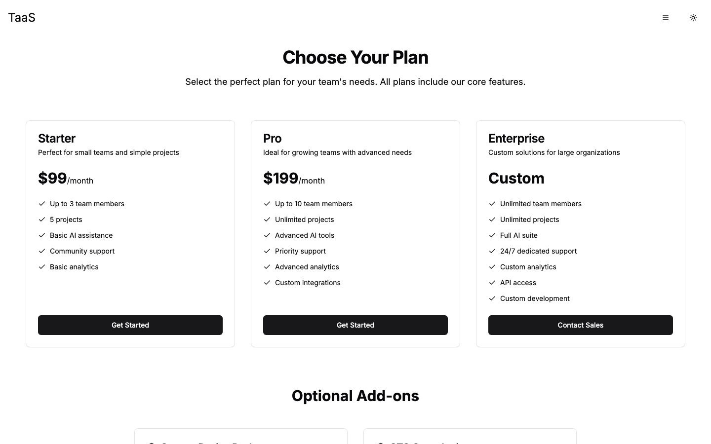
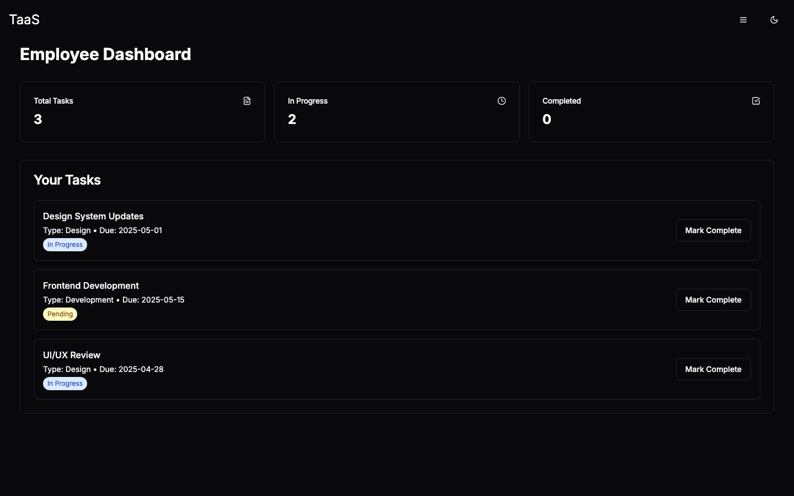

# TaaS — Team as a Service 🧑‍🚀

> Spin up a full product team on demand — designers, engineers, PMs, and an
> AI copilot that actually ships. **Build with teams, not headcount.**

TaaS is the marketing site *and* interactive product surface for a
"team-as-a-service" platform. A visitor drops in an idea, and the site walks
them through the whole journey: from a punchy, motion-polished landing page,
through a career/personality funnel, all the way to a **live drag-and-drop Team
Board**, workspace, calendar, and dashboard mockups that show what working
*with* your on-demand team actually feels like.

It's a fast single-page app built with React, Vite, Tailwind, and shadcn/ui,
with a Supabase backend handling waitlist signups and confirmation emails.

<p align="center">
  
</p>

<p align="center">
  <b><a href="https://taas.techrealm.ai">🌐 Live demo → taas.techrealm.ai</a></b>
</p>

---

## 🆕 What's new in this release

This cut is a deep polish-and-power pass. Eight focused work streams landed
at once — here's the headline act:

| ✨ New | What it does |
| --- | --- |
| **🗂 Interactive Team Board** | A full Kanban at [`/board`](https://taas.techrealm.ai/board) — drag cards across Backlog → To Do → In Progress → Done, filter by priority, search, add tasks, and watch a live progress bar. State persists to `localStorage`, so your board is right where you left it on reload. |
| **⌘ Command Palette** | Hit **⌘K / Ctrl-K** anywhere to fuzzy-jump between pages, flip the theme, and fire quick actions — no mouse required. |
| **🎨 UI polish pass** | A scroll-aware **frosted-glass nav** that settles into place as you scroll, a branded preloader that *can't* get stuck, custom scrollbars, refined focus rings, and a small kit of reusable interaction utilities — all honoring `prefers-reduced-motion`. |
| **♿ Accessibility + perf** | Skip-to-content link, keyboard-only focus rings, labelled landmarks, lazy/decoded images, and motion that respects your OS preference. |
| **🧪 A/B hero — copy *and* layout** | A dependency-free 50/50 headline split test, **plus** an alternate single-column conversion hero at `?variant=b`. Both deterministic and deep-linkable. |
| **🔎 SEO & discoverability** | Full Open Graph + Twitter cards, JSON-LD structured data, `sitemap.xml`, a PWA `webmanifest`, and a complete favicon set. |
| **📱 Mobile robustness** | Squashed horizontal-overflow bugs on the Task, API-Test, and AI-Marketing pages so nothing spills off small screens. |
| **✅ Real test suite** | 35 unit tests (Vitest + Testing Library), a Playwright e2e smoke spec, and a CI workflow — green on every push. |

---

## 🗂 The Team Board, up close

The star of this release. Everything you'd expect from a real board, in zero
external state libraries — just React + the native HTML drag-and-drop API.

<p align="center">
  
</p>

- **Drag-and-drop** cards between four columns; drops save instantly.
- **Live progress** — a "2 of 7 done (29%)" meter updates as work moves to Done.
- **Search + priority filter** to slice a busy board down to what matters.
- **Add / reset** tasks on the fly.
- **Persistent** — your layout is written to `localStorage`, so a refresh never
  loses your place.

---

## ⌘ Command palette (⌘K / Ctrl-K)

<p align="center">
  
</p>

Press **⌘K** (or **Ctrl-K**) on any page to open a keyboard-first launcher:
type to fuzzy-match a destination, jump to any route, or toggle the theme —
then `Esc` to dismiss. Power users, rejoice. 🕹️

---

## 📸 Screenshots

| Hero (desktop, light) | Hero (desktop, dark) |
| :---: | :---: |
|  |  |

> **One page, two themes.** A system-aware toggle keeps light and dark equally
> loved — and the scroll-aware nav frosts over on the way down.

| Mobile | Pricing | Employee dashboard |
| :---: | :---: | :---: |
|  |  |  |

---

## 🧪 The A/B hero test, in 20 seconds

No feature-flag service, no extra bundle weight — just two honest split tests:

**1. Copy split (automatic, 50/50).**

```ts
// src/pages/Index.tsx
const heroVariants = [
  { id: "A", headline: "Team as a Service",             subheadline: "On-demand AI + human experts…" },
  { id: "B", headline: "Ship faster with a team on tap", subheadline: "Spin up designers, engineers & PMs…" },
];
```

On first visit a variant is chosen 50/50, stored under `localStorage.heroVariant`,
and reused forever after. The rendered `<h1>` carries a `data-hero-variant`
attribute so analytics (or a curious QA engineer) can tell which bucket a
session landed in. Want to *always* see variant B? Pop the console and run
`localStorage.setItem('heroVariant','B')`, then reload. Science! 🧬

**2. Layout split (deterministic, deep-linkable).** Append **`?variant=b`** for
an alternate centered, single-column conversion hero (`?variant=a` forces the
control). Perfect for demos and QA — see
[`docs/hero-ab-variant.md`](docs/hero-ab-variant.md).

---

## 🛠 Tech stack

| Layer      | Tooling                                             |
| ---------- | --------------------------------------------------- |
| Framework  | React 18 + TypeScript                               |
| Build tool | Vite 5 (SWC)                                         |
| Styling    | Tailwind CSS + shadcn/ui (Radix primitives)         |
| Motion     | Framer Motion, reduced-motion aware                 |
| Data/state | TanStack Query, React Hook Form + Zod               |
| Charts     | Recharts                                            |
| Backend    | Supabase (Postgres, Storage, Edge Functions)        |
| Routing    | React Router v6 with lazy-loaded route chunks       |
| Testing    | Vitest + Testing Library, Playwright e2e, GitHub CI |

---

## 🚀 Getting started

Brand new to this? No sweat — if you can copy-paste, you can run TaaS. You'll
need **Node.js 18+** and **npm** (the easiest way to get both is
[nvm](https://github.com/nvm-sh/nvm#installing-and-updating)). That's the only
hard requirement to run the front end locally.

```sh
# 1. Clone the repo
git clone https://github.com/waleedsworld/build-with-teams.git
cd build-with-teams

# 2. Install dependencies
npm install

# 3. Start the dev server (hot-reloading, instant preview)
npm run dev
```

Then open the URL Vite prints (defaults to **http://localhost:8080**). Edit any
file under `src/` and the page updates live. That's it — you're building with teams.

### Build for production

```sh
npm run build     # outputs an optimized bundle to dist/
npm run preview   # serve the production build locally to sanity-check it
```

### Run the tests

```sh
npm test          # unit + component tests (Vitest)
npm run test:e2e  # Playwright end-to-end smoke test
```

---

## 🔌 Supabase (optional, for signups & emails)

The app ships with a public (anon) Supabase key baked into
`src/integrations/supabase/client.ts`, so the marketing site runs out of the box.
If you want to point it at **your own** project:

1. Create a project at [supabase.com](https://supabase.com).
2. Swap `SUPABASE_URL` and `SUPABASE_PUBLISHABLE_KEY` in
   `src/integrations/supabase/client.ts` for your project's values.
3. Apply the SQL in `supabase/migrations/` to set up the templates bucket and
   tables.
4. Deploy the Edge Functions in `supabase/functions/` (waitlist + confirmation
   email) with the Supabase CLI.

> The bundled key is a **public anon key** — safe to expose by design. Never
> commit a service-role key.

---

## 📁 Project layout

```
build-with-teams/
├── docs/media/        # GIF demo + screenshots used by this README
├── public/            # static assets, email templates, SEO files, favicons
├── src/
│   ├── components/     # navigation, sections, CommandPalette, dialogs + shadcn/ui kit
│   ├── pages/          # 20 route components (lazy-loaded), incl. BoardPage
│   ├── data/           # job listings, seed content
│   ├── hooks/          # use-mobile, use-toast, …
│   ├── integrations/   # supabase client + generated types
│   ├── test/           # Vitest setup
│   ├── App.tsx         # router + providers + command palette
│   └── main.tsx        # entry point
├── tests/e2e/          # Playwright smoke spec
├── supabase/           # migrations + edge functions
└── vite.config.ts
```

---

## 🧭 Notable routes

| Path                  | What it shows                          |
| --------------------- | -------------------------------------- |
| `/`                   | The main landing page (A/B hero)       |
| `/board`              | **New!** Interactive drag-and-drop Team Board |
| `/pricing`            | Starter / Pro / Enterprise plans       |
| `/about`              | Company story                          |
| `/careers`            | Job board (`/careers/:jobId` for each) |
| `/career/apply`       | Application + personality funnel       |
| `/dashboard`          | Employee task dashboard mockup         |
| `/workspace`          | Workspace view                         |
| `/calendar`           | Team calendar                          |
| `/ai-marketing`       | AI-marketing landing                   |
| `/fashion-case-study` | Case study page                        |

> 💡 Can't remember a path? Just press **⌘K**.

---

## 🌐 Live demo

**[taas.techrealm.ai](https://taas.techrealm.ai)** — deployed via Cloudflare
Pages. Prefer local? You're a minute away with the steps above.

---

Built with care by **Waleed Ajmal**.
